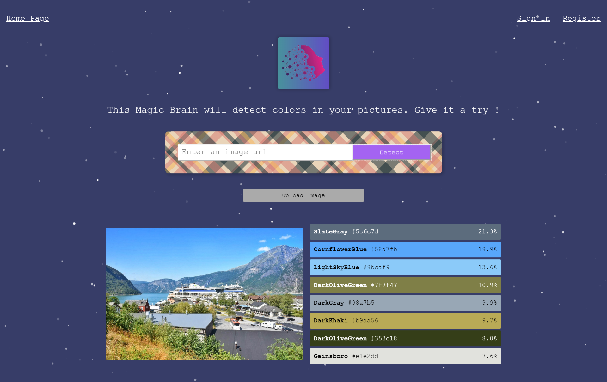

## Smart Brain

The "Color Recognition" model returns density values for dominant colors present in images.

    
    

## Smart Brain API
You can find the repo in https://github.com/imryckee/color-recognition-brain-api.